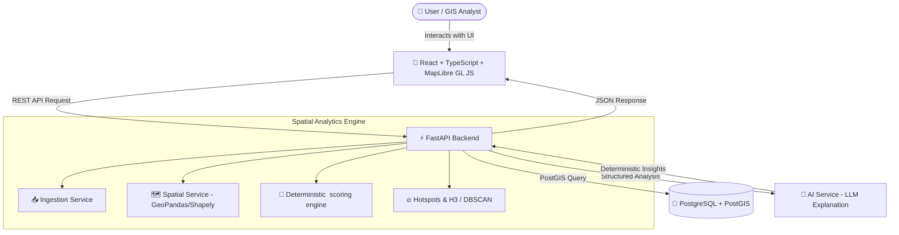

<p align="center">
  
  
  
  
  
</p>

<h1 align="center">📍 GeoReady</h1>
<h3 align="center">AI-Powered GeoSpatial Site Readiness Analyzer</h3>

<p align="center">
  <b>GeoReady</b> is an enterprise-grade location intelligence platform designed for business analysts, GIS professionals, and site planners. It centralizes multi-layer geospatial data processing, spatial scoring, constraint verification, and AI-driven spatial explanations into a modern interactive dashboard.
</p>

<p align="center">
  <a href="#-key-features">Key Features</a> •
  <a href="#-tech-stack">Tech Stack</a> •
  <a href="#-system-architecture">System Architecture</a> •
  <a href="#-getting-started">Getting Started</a> •
  <a href="#-core-workflow">Core Workflow</a> •
  <a href="#-documentation">Documentation</a>
</p>

---

## ✨ Key Features

- 🗺️ **Interactive Multi-Layer Map Engine**: Powered by MapLibre GL JS with custom dynamic layer toggling, density heatmaps, and spatial buffers.
- 🎯 **Deterministic 0–100 Scoring Engine**: Multi-criteria decision analysis (MCDA) combining customizable factor weights (Demographics, Accessibility, Competition, Land-Use, and Environmental Risk).
- 🤖 **AI-Powered Location Insights**: Integrated LLM assistant that ingests computed spatial metrics to generate human-readable site summaries, trade-offs, and site recommendation reports.
- ⏱️ **Isochrone & Catchment Analysis**: 10/20/30-minute travel time accessibility boundaries computed via OSRM routing algorithms.
- 🔍 **Opportunity Search & Hotspot Clustering**: Search study areas for qualifying zones using H3 spatial indexing, DBSCAN clustering, and Getis-Ord Gi* hotspot analysis.
- 📊 **Multi-Site Comparison**: Side-by-side site comparison dashboard comparing candidate locations across all normalized factor scores.

---

## 🛠️ Tech Stack

### **Frontend (`/DemoFrontend`)**
- **Framework**: React 19 + TypeScript + Vite
- **Styling & UI**: Tailwind CSS v4 + Motion (Framer Motion) + Lucide React
- **Mapping**: MapLibre GL JS
- **Data Visualization**: Recharts

### **Backend (`/backend`)**
- **Framework**: Python 3.11+ / FastAPI
- **GIS Processing**: GeoPandas, Shapely, PySAL, H3, scikit-learn
- **Database**: PostgreSQL + PostGIS (GeoAlchemy2 / SQLAlchemy)
- **AI Integration**: Google Gemini / OpenAI SDK (accessed via structured API backend)

---

## 🏗️ System Architecture



---

## 🚀 Getting Started

### Prerequisites
- **Node.js** (v18 or higher)
- **Python** (v3.11 or higher)
- **PostgreSQL** with **PostGIS** extension enabled

### 1️⃣ Frontend Setup

```bash
cd DemoFrontend
npm install
npm run dev
```
The frontend web application will start at `http://localhost:3000`.

### 2️⃣ Backend Setup

```bash
cd backend
python -m venv venv
# On Windows:
.\venv\Scripts\activate
# On macOS/Linux:
# source venv/bin/activate

pip install -r requirements.txt
uvicorn app.main:app --reload --port 8000
```
The FastAPI backend server will run at `http://localhost:8000` with interactive API docs at `http://localhost:8000/docs`.

---

## 🔄 Core Workflow

```text
DATA INGESTION ➔ VALIDATION ➔ SPATIAL ANALYSIS ➔ FEATURE EXTRACTION ➔ DETERMINISTIC SCORING ➔ MAP VISUALIZATION ➔ AI EXPLANATION ➔ REPORT GENERATION
```

---

## 📚 Documentation

The repository follows a detailed, modular documentation index. Read the full specifications inside the [`/Docs`](./Docs) folder:

- [`00_MASTER_INDEX.md`](./Docs/00_MASTER_INDEX.md) — Master Documentation Index & Rules
- [`01_PRODUCT_REQUIREMENTS.md`](./Docs/01_PRODUCT_REQUIREMENTS.md) — Product Vision & Specs
- [`03_DESIGN_SYSTEM.md`](./Docs/03_DESIGN_SYSTEM.md) — UI Tokens, Colors & Aesthetics
- [`04_FRONTEND_ARCHITECTURE.md`](./Docs/04_FRONTEND_ARCHITECTURE.md) — Frontend Guidelines
- [`05_BACKEND_ARCHITECTURE.md`](./Docs/05_BACKEND_ARCHITECTURE.md) — Backend Architecture & Service Design
- [`06_API_CONTRACT.md`](./Docs/06_API_CONTRACT.md) — API Endpoints & Request/Response Contracts
- [`08_SCORING_ENGINE.md`](./Docs/08_SCORING_ENGINE.md) — Mathematical Scoring Specification

---

## 📄 License

This project is licensed under the MIT License — see the [LICENSE](LICENSE) file for details.
